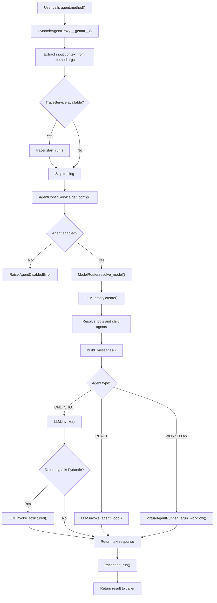
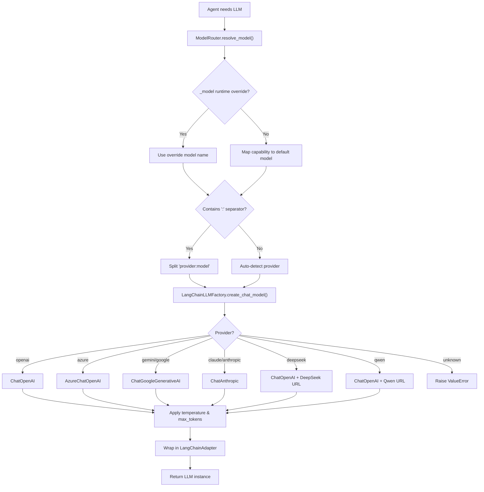
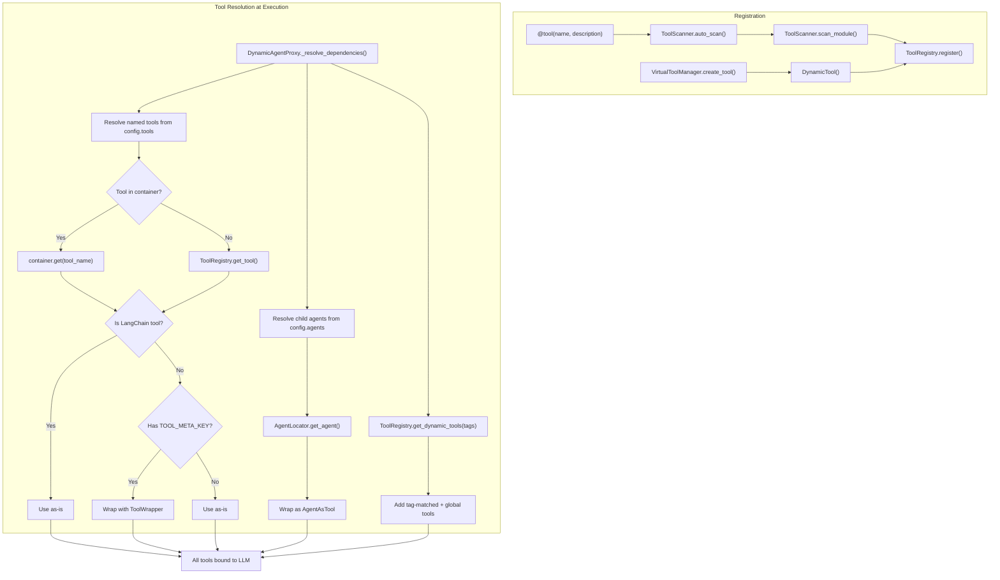
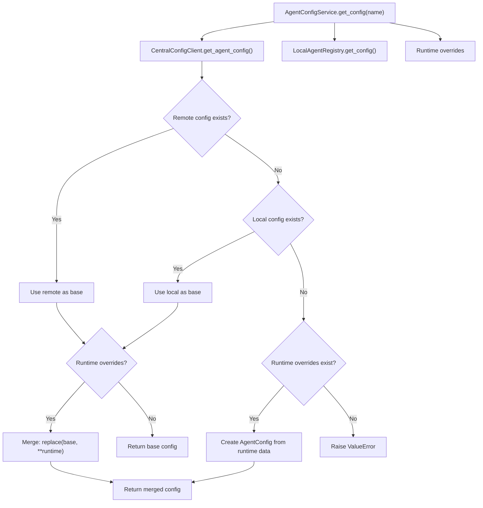
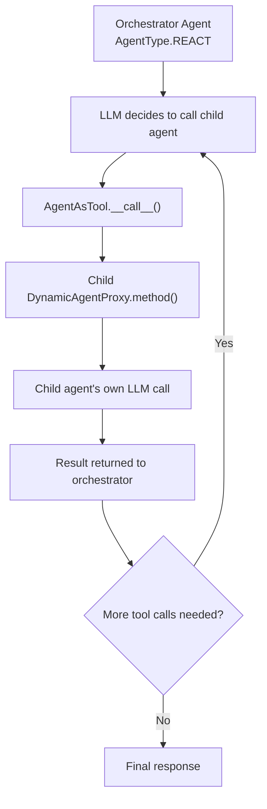
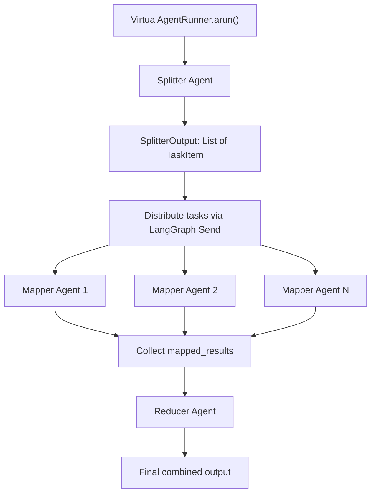
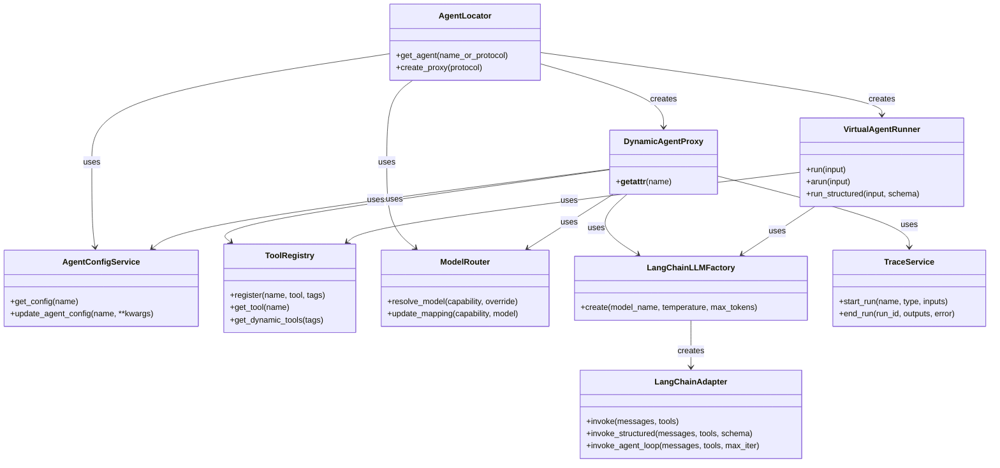

# Architecture

## Overview

Pico-Agent is built on top of Pico-IoC, leveraging its dependency injection capabilities to create a flexible and extensible multi-agent framework.

## Agent Execution Flow

The following diagram shows the complete lifecycle of an agent invocation, from user request to final response:



## Provider Resolution

This diagram shows how pico-agent selects the correct LLM provider and creates the appropriate chat model:



## Tool Registration and Invocation

This diagram shows the two paths for registering tools and how they are resolved at agent execution time:



## Configuration Hierarchy



## Multi-Agent Orchestration



## Map-Reduce Workflow



## Component Relationships



## Tracing

Built-in tracing captures:

- Agent invocations
- Tool calls
- LLM requests/responses
- Timing information
- Parent-child relationships via `run_context` ContextVar

## Configuration

Configuration hierarchy:

```
Global Config
    |
    |-- Provider Config
    |       +-- API keys, endpoints (LLMConfig)
    |
    |-- Agent Config
    |       +-- Model capability, temperature, tools
    |
    +-- Tracing Config
            +-- TraceService singleton
```
