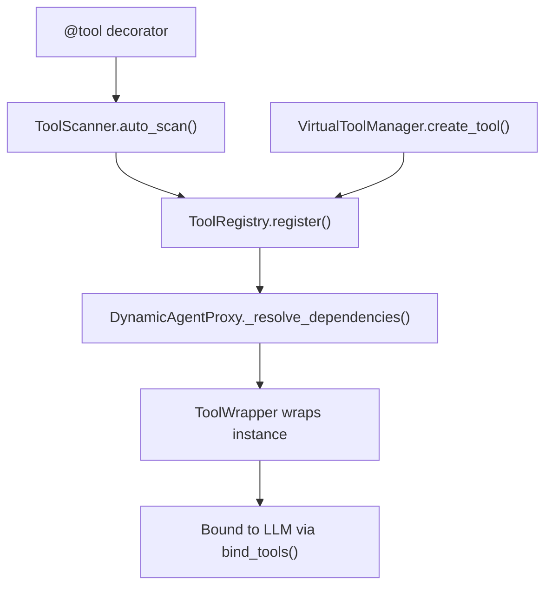

# How to Create Custom Tools

Tools extend agent capabilities by giving them access to external services,
databases, APIs, or any custom logic.  This guide covers all the ways to
create and register tools in pico-agent.

## Basics

A pico-agent tool is a class decorated with `@tool(name, description)` and
`@component`.  The LLM sees the **name** and **description** when deciding
which tool to invoke.

```python
from pico_ioc import component
from pico_agent import tool


@tool(name="calculator", description="Evaluate a mathematical expression")
@component
class CalculatorTool:
    def run(self, expression: str) -> str:
        return str(eval(expression))
```

### Required attributes

| Attribute | Purpose |
|---|---|
| `name` | Unique identifier -- must match the name used in `@agent(tools=[...])` |
| `description` | Shown to the LLM so it knows **when** to call the tool |

### Callable resolution

`ToolWrapper` looks for an entry point on your class in this order:

1. `__call__`
2. `run`
3. `execute`
4. `invoke`

If none of these exist, a `ValueError` is raised:

> Tool \<name\> must implement \_\_call\_\_, run, execute, or invoke.

## Tools with Dependencies

Tools are pico-ioc components, so they support full constructor injection:

```python
@tool(name="db_query", description="Run a SQL query against the database")
@component
class DatabaseQueryTool:
    def __init__(self, db_service: DatabaseService):
        self.db = db_service

    def run(self, query: str) -> str:
        rows = self.db.execute(query)
        return str(rows)
```

## Attaching Tools to Agents

Reference tools by name in the `@agent` decorator:

```python
from pico_agent import agent, AgentType

@agent(
    name="analyst",
    system_prompt="You are a data analyst.",
    agent_type=AgentType.REACT,
    tools=["calculator", "db_query"],
)
class AnalystAgent(Protocol):
    def analyze(self, question: str) -> str: ...
```

> **Tip:** Use `AgentType.REACT` for agents that need to iterate with tools.
> `ONE_SHOT` agents receive tool definitions but cannot loop.

## Tag-Based Dynamic Tools

Tools can be registered with **tags** so they are automatically attached to
any agent sharing those tags:

```python
tool_registry.register("logger_tool", LoggerTool(), tags=["observability"])
```

An agent with `tags=["observability"]` will automatically receive
`logger_tool` in addition to its explicitly listed tools.

Tools tagged with `"global"` are attached to **every** agent.

## Dynamic Tools at Runtime

Use `VirtualToolManager` to create tools from plain functions at runtime:

```python
from pico_agent import VirtualToolManager

manager = container.get(VirtualToolManager)

tool = manager.create_tool(
    name="greeting",
    description="Generate a personalised greeting",
    func=lambda name: f"Hello, {name}!",
)
```

### Custom argument schema

Pass a Pydantic model to control the tool's argument schema:

```python
from pydantic import BaseModel, Field


class GreetingInput(BaseModel):
    name: str = Field(description="The person's name")
    formal: bool = Field(default=False, description="Use formal tone")


tool = manager.create_tool(
    name="greeting",
    description="Generate a greeting",
    func=my_greeting_func,
    schema=GreetingInput,
)
```

## Agents as Tools

Child agents can be used as tools by a parent agent.  List them in the
`agents` parameter:

```python
@agent(
    name="orchestrator",
    agent_type=AgentType.REACT,
    agents=["research_agent", "writer_agent"],
)
class Orchestrator(Protocol):
    def run(self, task: str) -> str: ...
```

Each child agent is wrapped as an `AgentAsTool`, with its `args_schema`
derived from the child's Protocol method signature.  The LLM sees the child
agent's description and can invoke it like any other tool.

## Tool Registration Flow


