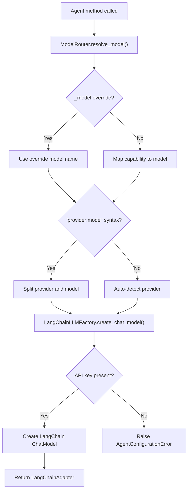

# How to Configure Multiple LLM Providers

Pico-Agent supports six LLM providers out of the box through LangChain.
This guide explains how to configure API keys, select providers, and use
multiple providers simultaneously.

## Supported Providers

| Provider | Install extra | Config key | Auto-detect keywords |
|---|---|---|---|
| OpenAI | `pico-agent[openai]` | `"openai"` | default fallback |
| Azure OpenAI | `pico-agent[openai]` | `"azure"` | `"azure"` |
| Anthropic (Claude) | `pico-agent[anthropic]` | `"anthropic"` | `"claude"`, `"anthropic"` |
| Google (Gemini) | `pico-agent[google]` | `"google"` | `"gemini"` |
| DeepSeek | `pico-agent[openai]` | `"deepseek"` | `"deepseek"` |
| Qwen | `pico-agent[openai]` | `"qwen"` | `"qwen"` |

Install all providers at once:

```bash
pip install pico-agent[all]
```

## Configuring API Keys

`LLMConfig` is registered as a singleton by `AgentInfrastructureFactory`.
**Do not** create your own `@factory` + `@provides` for `LLMConfig` -- that
would conflict with the existing registration.  Instead, use `@configure`
to populate the singleton:

```python
import os
from pico_ioc import component, configure
from pico_agent import LLMConfig


@component
class AppConfig:
    @configure
    def setup_llm(self, config: LLMConfig):
        # Standard provider keys
        config.api_keys["openai"] = os.getenv("OPENAI_API_KEY")
        config.api_keys["anthropic"] = os.getenv("ANTHROPIC_API_KEY")
        config.api_keys["google"] = os.getenv("GOOGLE_API_KEY")

        # Optional base URL overrides
        config.base_urls["anthropic"] = "https://custom-proxy.example.com"
```

### Key naming

The key in `api_keys` must match one of the provider names listed above.
For example, `config.api_keys["openai"]` is used when the provider is
detected as OpenAI.

## Provider Detection

When you specify a model name (via `AgentCapability` routing or directly),
`LangChainLLMFactory` detects the provider automatically:

| Model name contains | Detected provider |
|---|---|
| `"gemini"` | Google (Gemini) |
| `"claude"` or `"anthropic"` | Anthropic |
| `"deepseek"` | DeepSeek |
| `"qwen"` | Qwen |
| `"azure"` | Azure OpenAI |
| *(anything else)* | OpenAI |

### Explicit provider syntax

Use the `"provider:model"` syntax to bypass auto-detection:

```python
@agent(name="my_agent", capability=AgentCapability.SMART)
class MyAgent(Protocol):
    def run(self, q: str) -> str: ...

# Override at the ModelRouter level
router = container.get(ModelRouter)
router.update_mapping(AgentCapability.SMART, "anthropic:claude-3-5-sonnet")
```

Or override at call time using the `_model` keyword argument:

```python
agent = locator.get_agent("my_agent")
result = agent.run("Hello", _model="openai:gpt-5-mini")
```

## Using Multiple Providers Simultaneously

Different agents can use different providers simply by assigning different
capabilities or model names:

```python
from pico_agent import agent, AgentCapability, AgentType


@agent(
    name="fast_responder",
    capability=AgentCapability.FAST,   # -> gpt-5-mini (OpenAI)
    system_prompt="Answer quickly.",
)
class FastResponder(Protocol):
    def respond(self, q: str) -> str: ...


@agent(
    name="deep_thinker",
    capability=AgentCapability.REASONING,  # -> gemini-3-pro (Google)
    system_prompt="Think carefully.",
)
class DeepThinker(Protocol):
    def think(self, q: str) -> str: ...


@agent(
    name="coder",
    capability=AgentCapability.CODING,  # -> claude-3-5-sonnet (Anthropic)
    system_prompt="Write clean code.",
)
class Coder(Protocol):
    def code(self, spec: str) -> str: ...
```

### Customising the capability-to-model mapping

```python
from pico_agent.router import ModelRouter

router = container.get(ModelRouter)

# Change FAST to use DeepSeek
router.update_mapping("fast", "deepseek:deepseek-chat")

# Change SMART to use Claude
router.update_mapping("smart", "anthropic:claude-3-5-sonnet")
```

## LLM Profiles

Profiles let you configure multiple API keys for the **same** provider
(e.g., different billing accounts, rate limit pools, or proxy endpoints):

```python
@component
class AppConfig:
    @configure
    def setup_llm(self, config: LLMConfig):
        # Default OpenAI key
        config.api_keys["openai"] = os.getenv("OPENAI_API_KEY")

        # Premium profile with higher rate limits
        config.api_keys["openai_premium"] = os.getenv("OPENAI_PREMIUM_KEY")
        config.base_urls["openai_premium"] = "https://premium.openai.example.com"
```

Then reference the profile in the agent decorator:

```python
@agent(
    name="premium_agent",
    capability=AgentCapability.SMART,
    llm_profile="openai_premium",
    system_prompt="You have premium access.",
)
class PremiumAgent(Protocol):
    def answer(self, q: str) -> str: ...
```

When `llm_profile` is set, `LangChainLLMFactory` looks up the API key and
base URL using the profile name first, falling back to the provider name.

## Provider Resolution Flow



## Azure OpenAI Setup

Azure requires additional configuration:

```python
import os

@component
class AzureConfig:
    @configure
    def setup(self, config: LLMConfig):
        config.api_keys["azure"] = os.getenv("AZURE_OPENAI_API_KEY")

# Also set the API version via environment variable:
# AZURE_OPENAI_API_VERSION=2024-02-01
```

Use the Azure deployment name as the model name:

```python
router.update_mapping(AgentCapability.SMART, "azure:my-gpt4-deployment")
```

## DeepSeek and Qwen

DeepSeek and Qwen use OpenAI-compatible APIs with custom base URLs:

```python
@component
class CustomProviderConfig:
    @configure
    def setup(self, config: LLMConfig):
        # DeepSeek (default base URL: https://api.deepseek.com/v1)
        config.api_keys["deepseek"] = os.getenv("DEEPSEEK_API_KEY")

        # Qwen (default base URL: https://dashscope.aliyuncs.com/compatible-mode/v1)
        config.api_keys["qwen"] = os.getenv("QWEN_API_KEY")

        # Override base URL if needed
        config.base_urls["deepseek"] = "https://custom-deepseek.example.com/v1"
```

## Troubleshooting

### API Key not found

If you see:

> API Key not found for provider 'openai' (Profile: 'None'). Please configure it via LLMConfig.

Ensure you have configured the key in a `@configure` hook:

```python
config.api_keys["openai"] = os.getenv("OPENAI_API_KEY")
```

### Missing provider package

If you see:

> Please install 'pico-agent[openai]' to use this provider.

Install the required extra:

```bash
pip install pico-agent[openai]
```

### Unknown provider

If you see:

> Unknown LLM Provider: xyz

Use one of the supported provider names: `openai`, `azure`, `gemini`,
`google`, `claude`, `anthropic`, `deepseek`, `qwen`.
